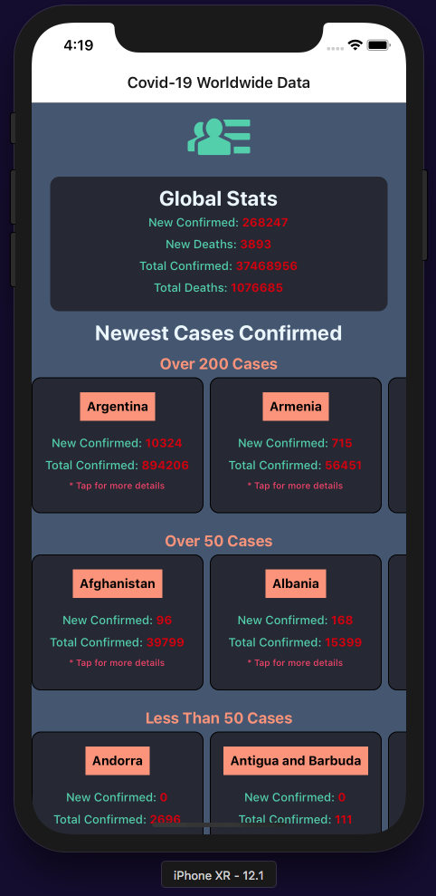
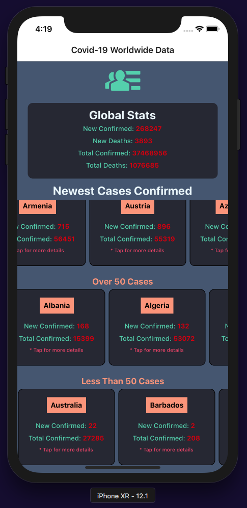
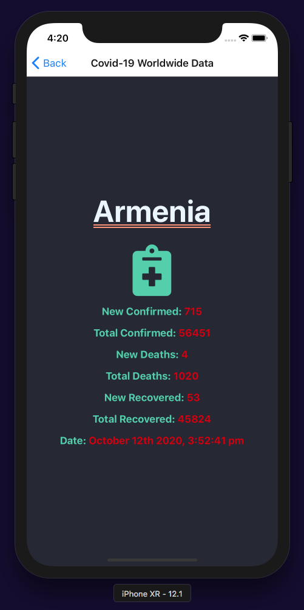

# React-Native App for Covid19 Worldwide Data

### Consuming data from the following API: https://covid19api.com/

## To View app on local computer:
## 1) npm install in terminal from project root.
## 2) Start simulator on Mac.
## 3) npm start from project root.
## 4) On browser window that opens for EXPO click 'Run an iOS simulator' (or one of the other simulators) - if it does not work, on your computer with Simulator app in focus, choose from your computer dropdown: Hardware > Erase All Content & Settings, then repeat step 3 above.
## 5) If there's a preference to view on actual mobile device:
##    a) Install Expo from the App Store on your phone (free app).
##    b) Open your phone camera and scan the QR Code and click yes when asked on your phone if you'd like to open in EXPO.

<h4 align="center">Views</h4>

  
  
  

   
<h4 align="center">Home Page View</h4>

  

<h4 align="center">Home Page Scroll View</h4>

  

<h4 align="center">Data Show Page</h4>

  

